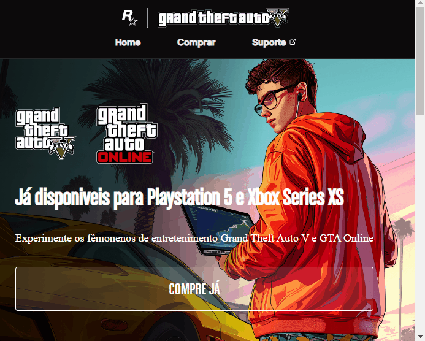

# Clone da landing page de jogos GTA Grand Theft Auto V.

Página estruturada com código HTML prevalecendo a organização dos elementos e a semântica, garantindo assim a acessibilidade e mecanismos de busca da página. Nesse projeto, apliquei propriedades CSS para um layout responsivo e visual agradável, contudo para sua funcionalidade interativa utilizei a linguagem JavaScript.

## Índice

- [Visão Geral](#visão-geral)
    - [O projeto](#o-projeto)
    - [Captura tela](#captura-tela)
    - [Link](#link)
- [Meu progresso](#meu-progresso)
    - [Construído com](#construído-com)
    - [O que eu aprendi](#o-que-eu-aprendi)
- [Autor](#autor)
- [Agradecimentos](#agradecimentos)

## Visão Geral

### O projeto

Os usuários devem ser capazes de:

- Ver o layout ideal dependendo do tamanho da tela do dispositivo.
- Ver os estados de foco para elementos interativos

### Captura tela
[]

### Link

- URL do site ativo: [projetoGta](https://simonesi.github.io/projetoGta/)

## Meu progresso

### Construído com

- HTML5 semântico
- CSS propriedades personalizadas
- Flexbox
- Tela responsiva
- JavaScript

### O que eu aprendi

```js

botao.addEventListener("click", () => {
    const botaoEstaAberto = elementoPlataformas.classList.contains("ativo");
        console.log(botaoEstaAberto);
    if(botaoEstaAberto) {
        elementoPlataformas.classList.remove("ativo")
    }else{
        elementoPlataformas.classList.add("ativo");
    }
})
```
Refatoração das condicionais if...else com o método toggle('🎉')

```js
botao.addEventListener("click", () => {  
 elementoPlataformas.classList.toggle("ativo")
 });

```

## Autor

- Website linkedln - [Simone Lima](https://www.linkedin.com/in/sslima-simone)

## Agradecimentos

Dev em Dobro
